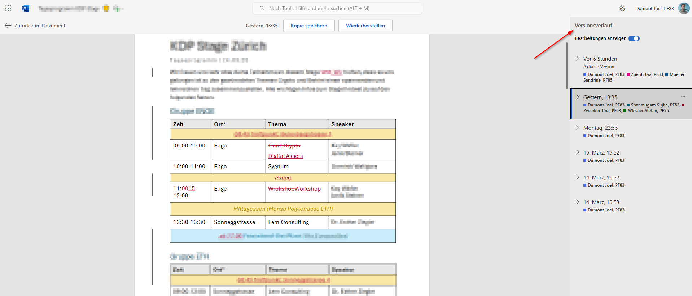

= What is a SCM (Source Control Management)

== Manual versioning

Who doesn't know it. One creates a new document and save a V1 to make sure we don't loose anythig we previously worked on. Then V2 and so on.

image::resources/manual-versioning.png[]

== Cloud based collaboration tools

Cloud based version histories like the one from Microsoft-365 word are helpful to keep track of what changed but are far away from what's possible with git.

* no fast comparison between two version
* no going back to a later state of the file
* revert is only possible if someone did not change in the meantime
* requires connection to the internet
* No comment what changed
* System decides in which time interval a change is added to the history
* ...

.Microsoft-365 Word

