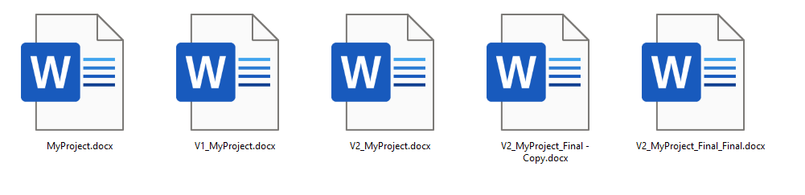
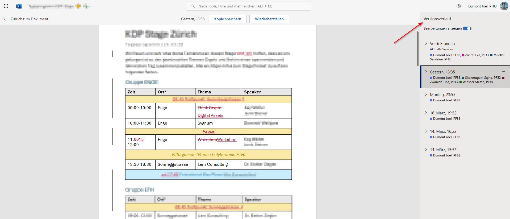
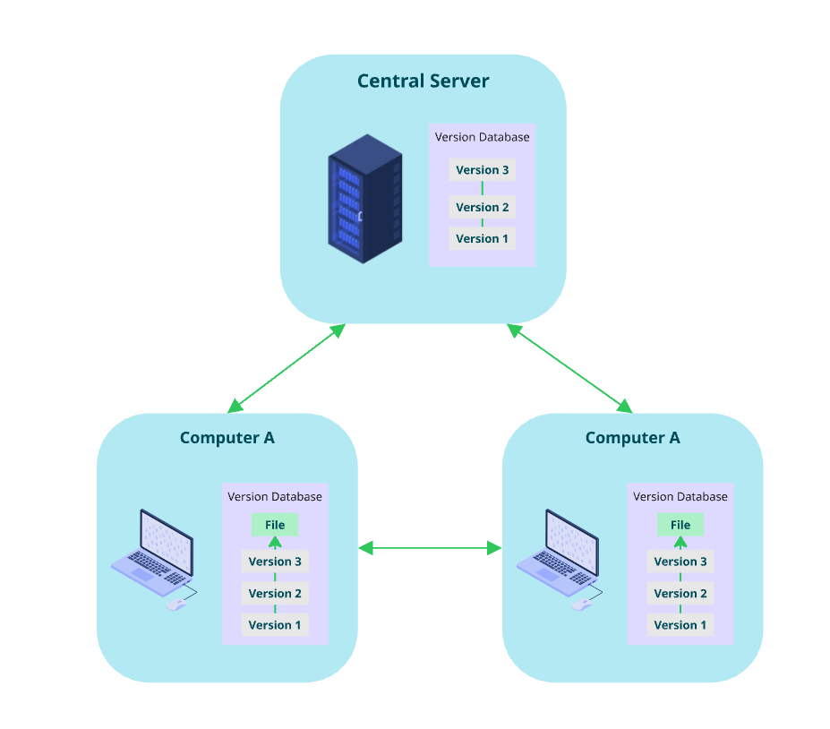

= What is a VCS (Version Control System)

== Manual versioning

Who doesn't know it. One creates a new document and save a V1 to make sure we don't lose anything we previously worked on. Then V2 and so on.

== Cloud based collaboration tools

Cloud based version histories like the one from Microsoft-365 word are helpful to keep track of what changed but are far away from what's possible with git.

* no fast comparison between two version
* no going back to a later state of the file
* revert is only possible if someone did not change in the meantime
* requires connection to the internet
* No comments on what changed
* System decides in which time interval a change is added to the history
* ...

.Microsoft-365 Word

== Distributed Version Control Systems
A distributed version control system (DVCS) like Git allows multiple people to work on the same project simultaneously without overwriting each other's changes. Each contributor has a complete copy of the repository, including its history, on their local machine. This means that you can work offline and still have access to all the features of version control.

In the beginning, Git was designed to manage the Linux kernel development, which involved thousands of contributors. It needed to be fast, efficient, and capable of handling large projects with a distributed team. 

The following video shows activity in the official Git repository and how developers worked on it. Gource was used to create the visualization.

video::resources/git-distributed-vcs.mp4[width=80%,align=center]

[cols="a,>a",frame=none,grid=none]
|===
|
|xref:01_About_Git.adoc[Continue to About Git ->]
|===

