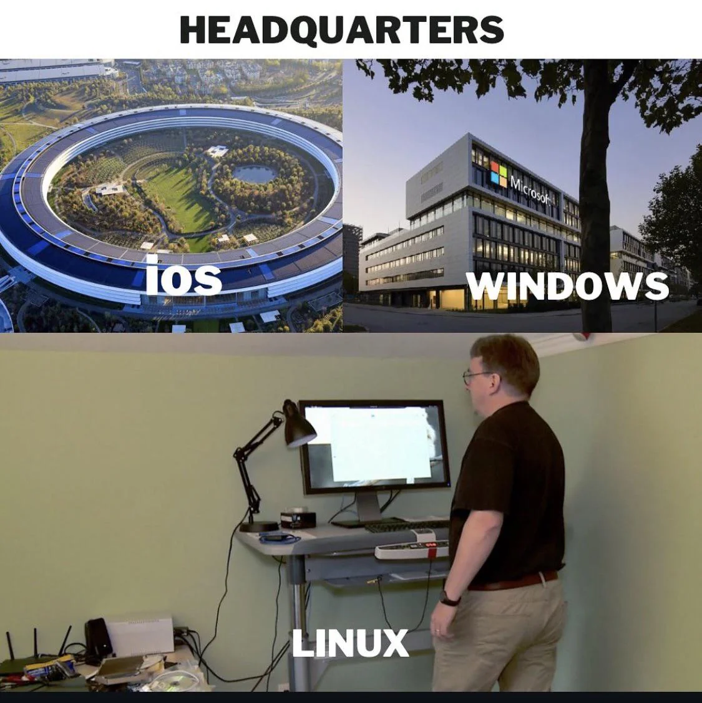
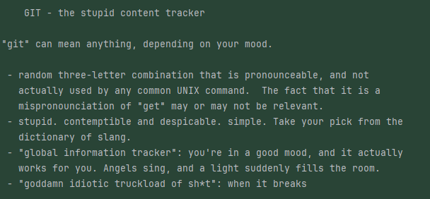
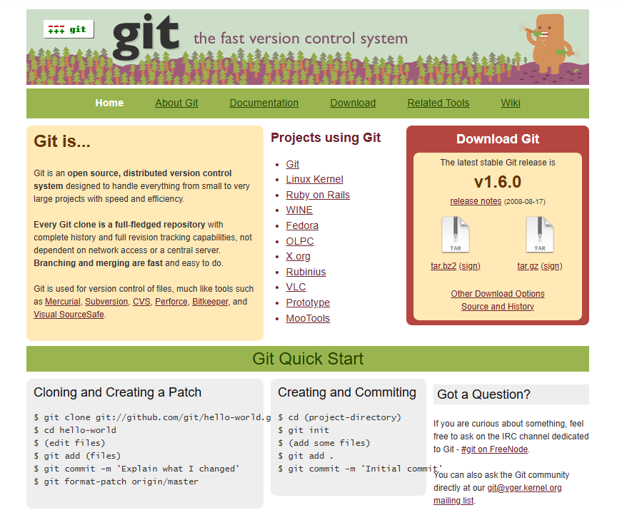
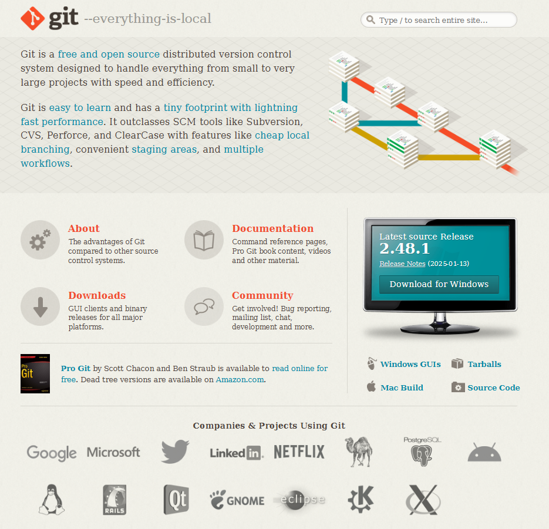

= About GIT

== Linux Torwalds

Git was created in *2005 by Linus Torvalds*, the same person who developed Linux, one of the most important operating systems in the world.
At that time, the Linux kernel project — with thousands of contributors — needed a fast, reliable, and distributed version control system. Existing tools either didn’t scale well or weren’t open source.
So Linus designed Git to solve these problems:

Speed
Data integrity
Support for distributed workflows
In just a few weeks, Linus built the first version of Git. Today, Git has grown into the most popular version control system, used by millions of developers worldwide — from open-source projects to large corporations like Google and Microsoft.

[quote, Linus Torwalds]
____
I'm an egotistical bastard, and I name all my projects after myself. First 'Linux', now 'Git'.
____

== Git name and meaning
Official GIT repository: https://github.com/git/git

The first commit message is remarkable.

.First git-commit message
image::./resources/linus-first-commit.png[align=center]

.initial ReadMe.md

___
📌 Demo first git commit +
📌 Show git repo evolution

___

== Evolution: Then vs. Now

In 2006, Git was still new and primarily used by the Linux kernel project, which was the driving force behind its creation. Early adopters included other open-source projects like X.org and Ruby on Rails, but mainstream adoption was still limited, as many teams were using Subversion (SVN), Mercurial, or Perforce at the time.

Fast forward to today, Git has become the industry standard. It is used by nearly every major tech company and open-source project. Platforms like GitHub, GitLab, and Bitbucket have made Git the backbone of software development. Some of the biggest projects using Git now include:

* Linux Kernel (still!)
* Kubernetes (Google)
* React, Angular, and Vue.js (Frontend frameworks)
* Android OS (Google)
* TensorFlow (AI/ML by Google)
* Microsoft Windows source code (since Microsoft moved from TFVC to Git)
* NASA (for software development in space projects)

=== Website 2008

=== Website 2025

[cols="a,a",frame=none,grid=none]
|===
|xref:00_What_is_a_SCM.adoc[<= What is a SCM]
|xref:02_When_use_Git.adoc[When use Git =>]
|===

