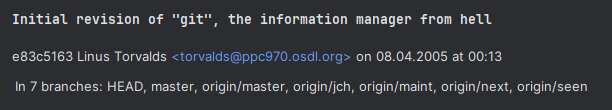

= About GIT

== Linus Torwalds

Git was created in 2005 by Linus Torvalds, the same person who developed Linux, one of the most important operating systems in the world.
At that time, the Linux kernel project — with thousands of contributors — needed a fast, reliable, and distributed version control system. Existing tools either didn’t scale well or weren’t open source.
So Linus designed Git to solve these problems:

Speed
Data integrity
Support for distributed workflows
In just a few weeks, Linus built the first version of Git. Today, Git has grown into the most popular version control system, used by millions of developers worldwide — from open-source projects to large corporations like Google and Microsoft. 1

[quote, Linus Torwalds]
____
I'm an egotistical bastard, and I name all my projects after myself. First 'Linux', now 'Git'.
____

== Git meaning
Official GIT repository: https://github.com/git/git

The first commit message is remarkable.

image::../resources/git-meaning[]

== Website 2008

image::../resources/git-2008-website[]

== Website 2025
image::../resources/git-2025-website[]
link:../resources/book-pro-git.pdf[Git Pro Book]

//* Todo:

// * Conventional Commits: https://www.conventionalcommits.org/en/v1.0.0/
//
// * https://learngitbranching.js.org/[Learn Git Branching]
//
// * Git behind the scene: https://ftp.newartisans.com/pub/git.from.bottom.up.pdf
//
// * Drawback:
// ** binary files
//
//
// * https://docs.asciidoctor.org/asciidoc/latest/[AsciiDoc]
// * https://gitlab.com/antora/antora[Antora]
