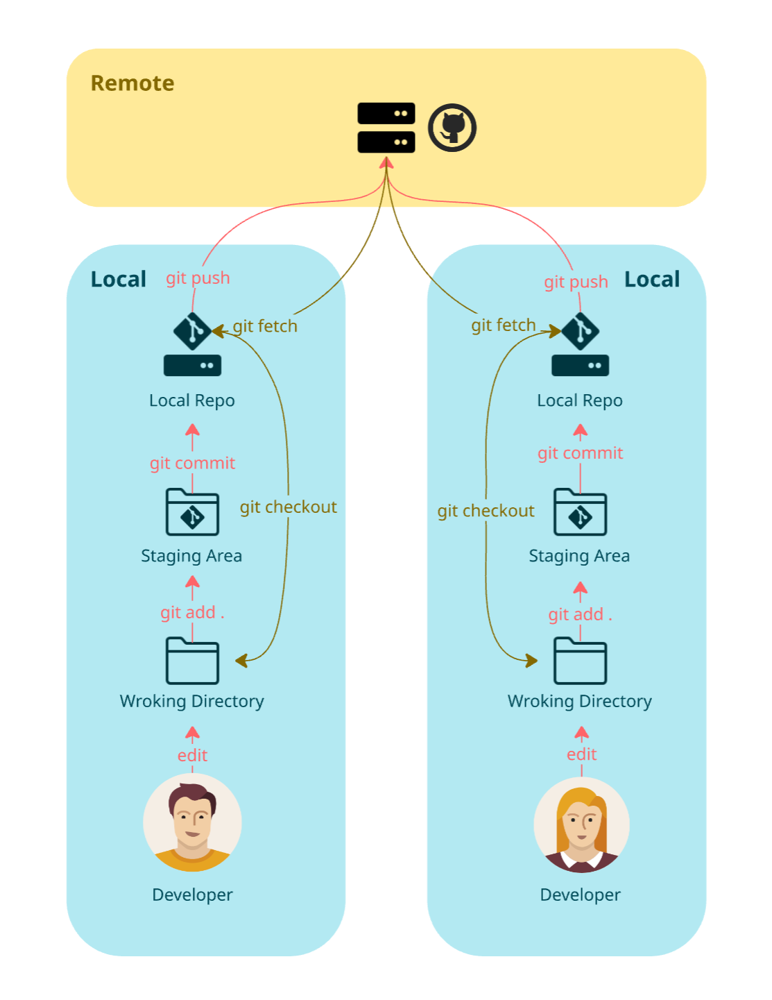

= Git Workflow

== Simple Git Workflow

1. Create or change files in your project.
2. Check what changed:
+
[source,bash]
----
git status
----

3. Add the files you want to include in the next commit:
+
[source,bash]
----
git add .
----

4. Create a commit with a meaningful message:
+
[source,bash]
----
git commit -m "add login form"
----

5. Upload your work to the remote repository:
+
[source,bash]
----
git push
----

This is the basic cycle you will use most of the time:

`edit -> git status -> git add -> git commit -> git push`

[cols="a,>a",frame=none,grid=none]
|===
|xref:01_What_is_a_VCS.adoc[<- Back to What is a VCS]
|xref:03_Terminology.adoc[Continue to Terminology ->]
|===
