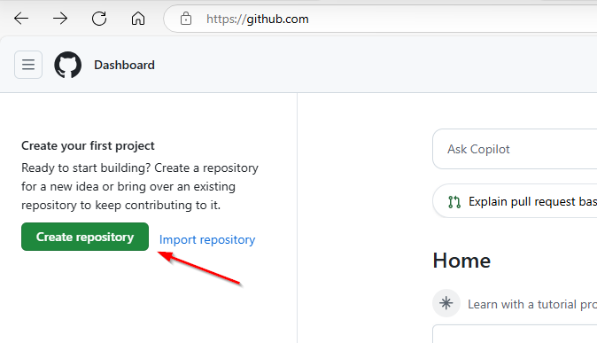
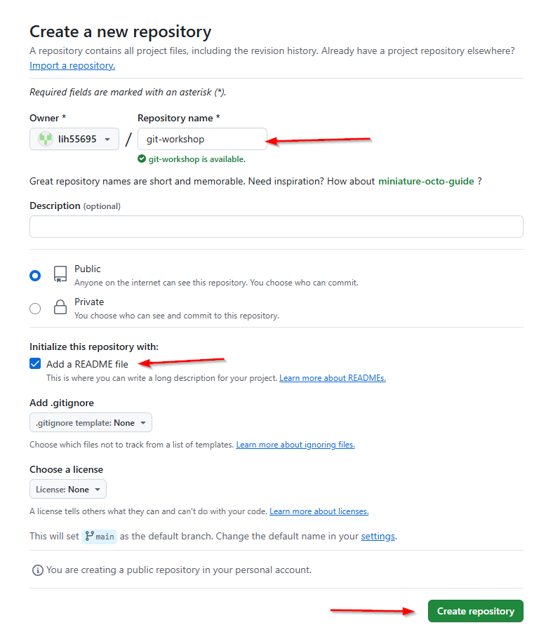
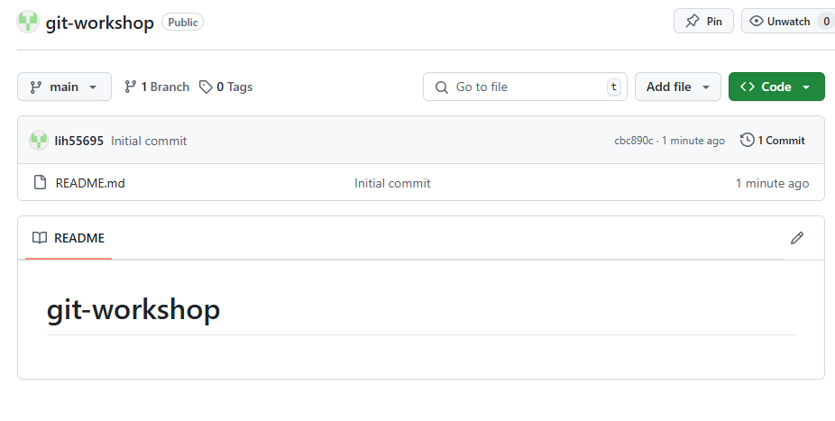

= Git Workflow

. If you don't already have a GitHub account, https://github.com/[sign up at GitHub.com] +
(with own email or https://10minutemail.net[10minute-mail])
. Create a repository
+

. Choose a name for the repo and create it
+

. Done 🥳
+

[cols="a,>a",frame=none,grid=none]
|===
|xref:01_About_Git.adoc[<- Back to About Git]
|xref:03_Terminology.adoc[Continue to Terminology ->]
|===
