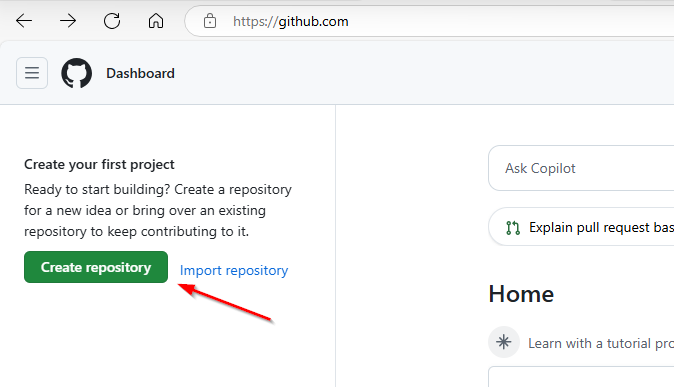
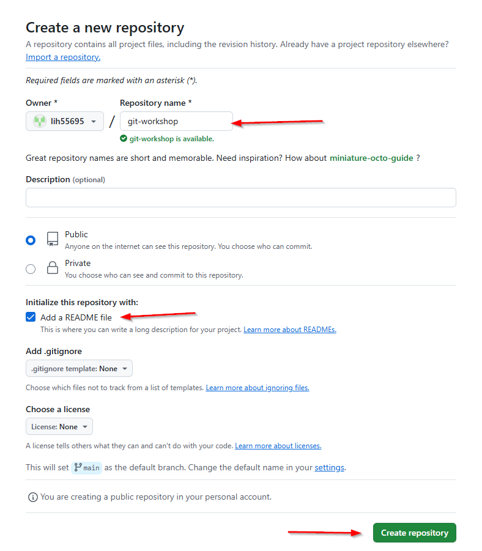
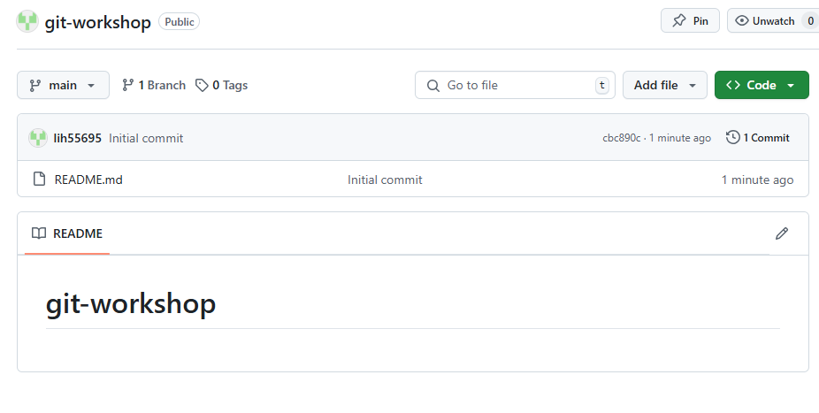

= Initialize a GitHub Repo

. If you don't already have a Github-Account, https://github.com/[sign up at Github.com] +
(with own email or https://10minutemail.net[10minute-mail])
. Create a repository
+

. Choose a name for the repo and create it
+

. Done 🥳
+

[cols="a,a",frame=none,grid=none]
|===
|xref:02_When_use_Git.adoc[<= When use Git]
|xref:04_Install_git.adoc[Install Git =>]
|===
