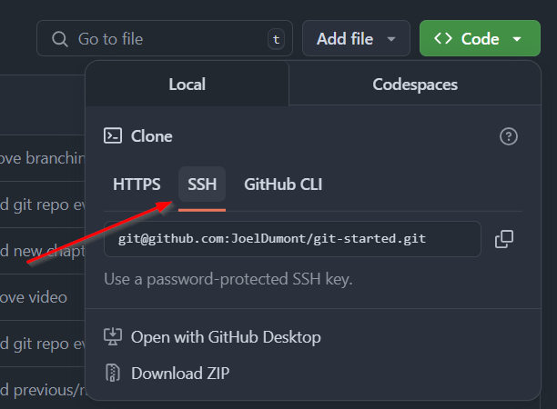

= Setup Git

== Install Git

=== ✅ Install
==== Windows

https://git-scm.com/downloads/win[Download Git] and follow install wizard

==== Linux

[bash]
----
sudo apt update
sudo apt install git -y
----

==== Mac

[bash]
----
brew install git
----

=== ✅ Check version
[bash]
----
git --version
----

== 🔑 Generating SSH Keys and Adding Them to GitHub

Using SSH keys with GitHub allows secure authentication without entering your password each time you push or pull code. Follow these steps to generate an SSH key and add it to GitHub.

=== ✅ 1. Check for Existing SSH Keys

Before generating a new key, check if you already have one.

**Run this command:**
[source,sh]
----
ls -al ~/.ssh
----

If you see files like `id_rsa.pub`, `id_ed25519.pub`, or `id_dsa.pub`, an SSH key already exists.

=== ✅ 2. Generate a New SSH Key

If you don’t have an existing key or want to create a new one, generate it using:

**Command (recommended Ed25519 algorithm):**
[source,sh]
----
ssh-keygen -t ed25519 -C "your_email@example.com"
----

If your system does not support `ed25519`, use RSA (less recommended):
[source,sh]
----
ssh-keygen -t rsa -b 4096 -C "your_email@example.com"
----

**Follow these steps:**
- When prompted, **press Enter** to save the key in the default location (`~/.ssh/id_ed25519`).
- Enter a **secure passphrase** (or leave it empty for no passphrase).

=== ✅ 3. Add the SSH Key to the SSH Agent

To use the SSH key, add it to the SSH agent:

**Start the SSH agent:**
[source,sh]
----
eval "$(ssh-agent -s)"
----

**Add your key to the agent:**
[source,sh]
----
ssh-add ~/.ssh/id_ed25519
----

---

=== ✅ 4. Copy the SSH Key

Now, copy the SSH key to add it to GitHub.

**Command to copy the key:**
[source,sh]
----
cat ~/.ssh/id_ed25519.pub
----

**Alternatively, use:**
[source,sh]
----
clip < ~/.ssh/id_ed25519.pub  # Windows (Git Bash)
pbcopy < ~/.ssh/id_ed25519.pub  # macOS
xclip -sel clip < ~/.ssh/id_ed25519.pub  # Linux
----

---

=== ✅ 5. Add the SSH Key to GitHub

1. Go to **GitHub** → Click on your profile → **Settings**.
2. In the left menu, click **SSH and GPG keys**.
3. Click **New SSH Key**.
4. **Paste** the copied SSH key.
5. Click **Add SSH Key**.

---

=== ✅ 6. Test the SSH Connection

Verify that the SSH key works with GitHub:

**Run this command:**
[source,sh]
----
ssh -T git@github.com
----

**Expected output:**

----
Hi username! You've successfully authenticated, but GitHub does not provide shell access.
----

[cols="a,a",frame=none,grid=none]
|===
|xref:03_Init_Github_repo.adoc[<= Init Github Repo]
|xref:05_Terminology.adoc[Git Terminology =>]
|===
