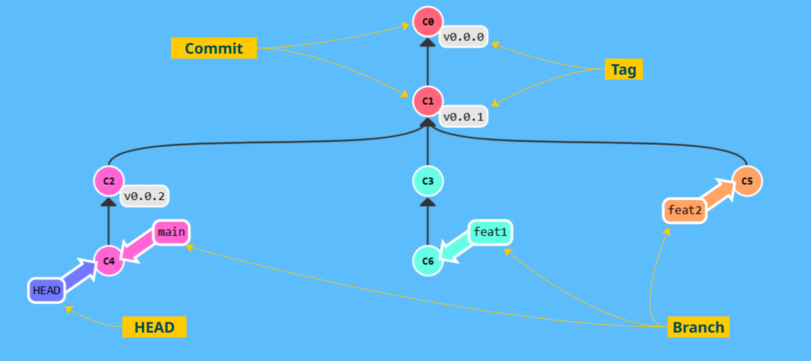

= Terminology

== Commit
A commit in a git repository records a snapshot of all the (tracked) files in your directory. It's like a giant copy and paste, but even better!

Git wants to keep commits as lightweight as possible though, so it doesn't just blindly copy the entire directory every time you commit. It can (when possible) compress a commit as a set of changes, or a "delta", from one version of the repository to the next.

📌 Check the first commit of this repo

== Tags

== Branch

== HEAD
