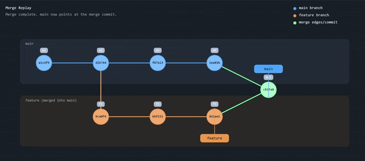
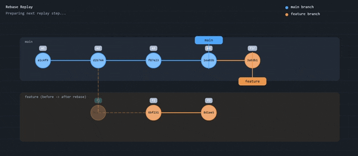
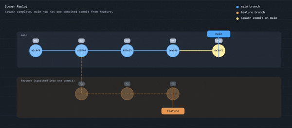

== Branching

=== Merge

* Merge creates a new commit (merge-commit)
+
This strategy is used by the git-project by itself:

image::resources/git-merge.png[align=center,width=100%]

___
📌 Provoke a merge conflict 

pass:[ ]

=== Rebase

* Rebase adds commits at the end of the target branch without a new commit and assures a linear history.

image::resources/rebase-strategy.png[align=center,width=100%]

pass:[ ]

=== Squash + Rebase

image::resources/rebase-clean.png[align=center,width=60%]

pass:[ ]

* https://joeldumont.github.io/playground[Source of Git Merge/Rebase/Squash animations]

[cols="a,>a",frame=none,grid=none]
|===
|xref:04_Conventional_Commits.adoc[<- Back to Conventional Commits]
|xref:06_Github.adoc[Continue to Github Features ->]
|===
