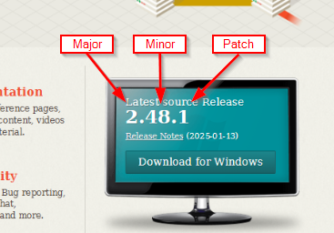

= GIT Commits

== Commit
A commit in a git repository records a snapshot of all the (tracked) files in your directory. It's like a giant copy and paste, but even better!

Git wants to keep commits as lightweight as possible though, so it doesn't just blindly copy the entire directory every time you commit. It can (when possible) compress a commit as a set of changes, or a "delta", from one version of the repository to the next.

Git also maintains a history of which commits were made when. That's why most commits have ancestor commits above them -- we designate this with arrows in our visualization. Maintaining history is great for everyone working on the project!

It's a lot to take in, but for now you can think of commits as snapshots of the project. Commits are very lightweight and switching between them is wicked fast!

== Conventional Commits
A specification like https://www.conventionalcommits.org/en/v1.0.0/[Conventional-Commits] can help to have a more uniform commit-history and enables you to generate versions depending on the commit title.
E.g. commit contains "fix: " as a prefix, then increment the patch-version

Conventional-Commits:

type: fix | feat | chore | docs | test +
breaking change: ! or BREAKING CHANGE
----
<type>[optional scope]: <description>

[optional body]

[optional footer(s)]
----
examples:
----
fix: prevent racing of requests

Introduce a request id and a reference to latest request. Dismiss
incoming responses other than from latest request.
----
or
----
feat!: allow provided config object to extend other configs
----

Semantic-Versioning:

== Branching
A branch is just a pointer or link to a specific commit

=== Git-Flow vs GitHub-Flow

source: https://quangnguyennd.medium.com/git-flow-vs-github-flow-620c922b2cbd[Medium-Article]

=== Merge vs Rebase

* Merge creates a new commit (merge-commit)
+
This strategy is used by the git-project by itself:

image::resources/git-merge.png[]

* Rebase adds commits at the end of the target branch without a new commit

== Online tutorials
* https://learngitbranching.js.org[Git Tutorials]

== Command overview
link:resources/git-cheat-sheet-education.pdf[Git Cheat-Sheet]
