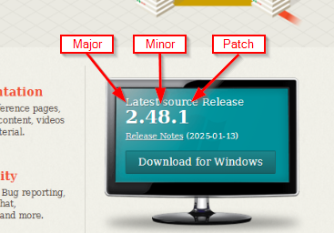

= Conventional Commits

== Conventional Commits
A specification like https://www.conventionalcommits.org/en/v1.0.0/[Conventional-Commits] can help to have a more uniform commit-history and enables you to generate versions depending on the commit title.

Semantic-Versioning:

== Semantic Release Commit Analysis

`@semantic-release/commit-analyzer` reads conventional commit messages and determines the version bump based on the commit type:

[cols="1,1,1",options="header"]
|===
| Commit Type | Version Bump | Notes
| `feat` | *MINOR* | New feature
| `fix` | *PATCH* | Bug fix
| `feat!` or any type with `!` | *MAJOR* | Breaking change
| `chore` | *None* | Ignored (unless has `!`)
| `docs`, `style`, `refactor`, `perf`, `test` | *None* | Ignored
|===

*Examples:*

- `feat: add new endpoint` → v1.0.0 → v1.1.0
- `fix: resolve login bug` → v1.1.0 → v1.1.1
- `feat!: remove old API` → v1.1.1 → v2.0.0 (breaking change)
- `chore: update dependencies` → v2.0.0 → v2.0.0 (no bump)
- `feat(api)!: redesign response` → MAJOR bump

Semantic-release combines all commits since the last tag and determines the *highest* bump needed. If there's a `feat!` anywhere, it's MAJOR; otherwise if there's a `feat`, it's MINOR; otherwise if there's a `fix`, it's PATCH.

___
📌 Demo control-room conventional-commits

___
📌 Demo what release.yml does

[cols="a,>a",frame=none,grid=none]
|===
|xref:03_Terminology.adoc[<- Back to Terminology]
|xref:06_Branching.adoc[Continue to Branching ->]
|===
