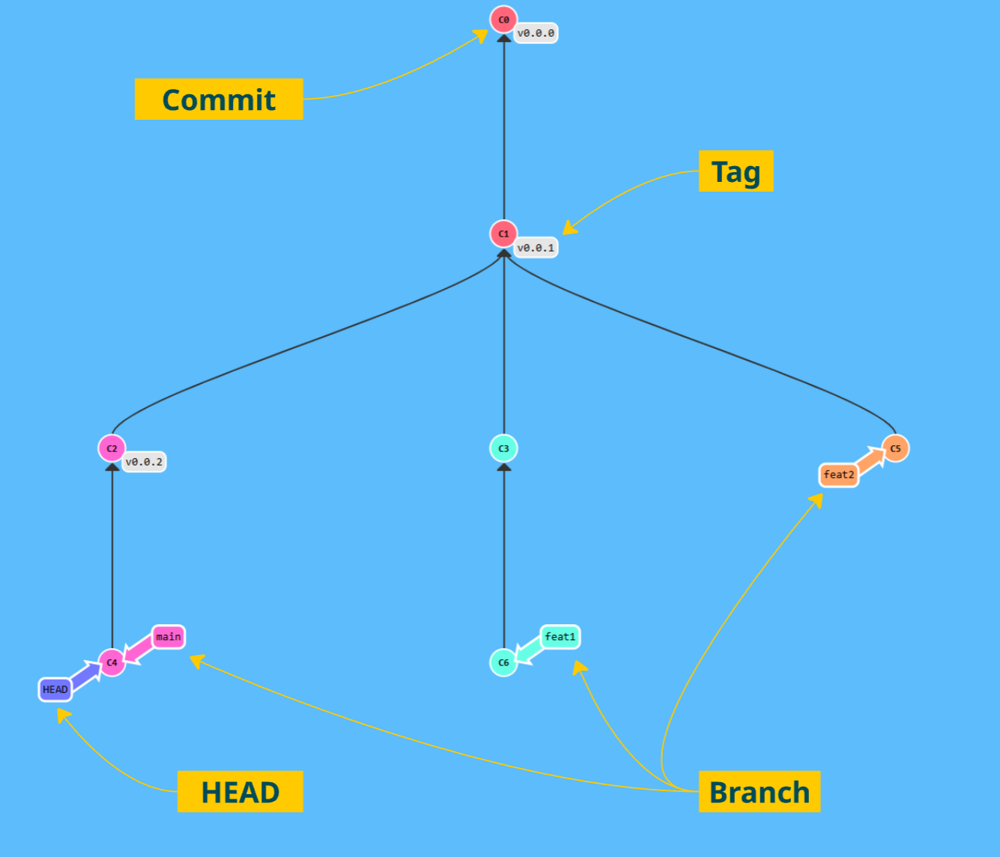
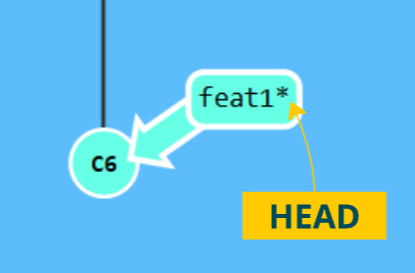
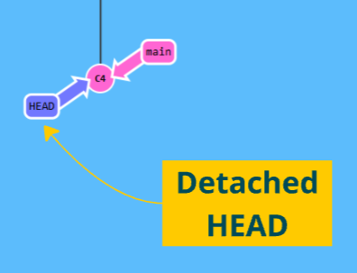

= Terminology

A Git-Repo consists of the following elements:

== LULU
A *commit* in a git repository records a snapshot of all the (tracked) files in your directory. It's like a giant copy and paste, but even better!

Git wants to keep commits as lightweight as possible though, so it doesn't just blindly copy the entire directory every time you commit. It can (when possible) compress a commit as a set of changes, or a "delta", from one version of the repository to the next.

----
git commit -m "<commit-message>"
----

== Tags

A **tag** is a reference to a specific point in a Git repository's history. It's commonly used to mark important milestones such as releases or versions of a project. The key difference to a branch is, that they are immutable and don't move forward when new changes are added.

1. **Lightweight tag**:
A simple pointer to a commit, similar to a branch, but **immutable**.
----
git tag v0.0.0
----

2. **Annotated tag**:
A more detailed tag that includes additional information such as the tagger's name, email, date, and an optional message.
----
git tag -a v0.0.0 -m "<tag-message>"
----
___
📌 Demo Antora-Doc with version tags

== Branch

A **Git branch** is a pointer to a specific commit in a Git repository. It allows you to diverge from the main line of development and work on changes without affecting the `main` branch (or any other branch). Each branch represents an independent line of development.

.*old* syntax:
----
git checkout -b "<branch-name>"
----

.*new* syntax:
----
git switch -c "<branch-name>"
----

== HEAD

* HEAD is a pointer in Git that shows your current working location (commit or branch).

* It typically points to the latest commit on the current branch.

* A detached HEAD state occurs when HEAD points to a specific commit, not a branch.

___
📌 Try the 1. tutorial *Introduction to Git Commits*: https://learngitbranching.js.org[Git Tutorials]

___

[cols="a,a",frame=none,grid=none]
|===
|xref:04_Install_git.adoc[<= Install Git]
|xref:06_Conventional_Commits.adoc[Conventional Commits =>]
|===
