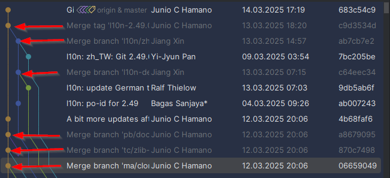

== Branching
A branch is just a pointer or link to a specific commit

=== Git-Flow vs GitHub-Flow

source: https://quangnguyennd.medium.com/git-flow-vs-github-flow-620c922b2cbd[Medium-Article]

=== Merge vs Rebase

* Merge creates a new commit (merge-commit)
+
This strategy is used by the git-project by itself:

* Rebase adds commits at the end of the target branch without a new commit

== Online tutorials
* Try the 2. tutorial *Branching in Git*: https://learngitbranching.js.org[Git Tutorials]

== Command overview
link:resources/git-cheat-sheet-education.pdf[Git Cheat-Sheet]
