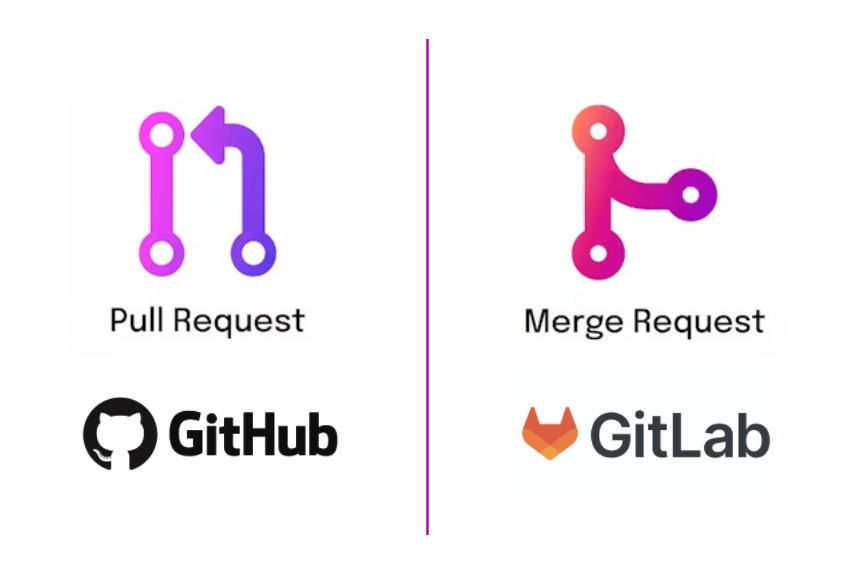

= Github Features

== Protect Main Branch

Branch protection rules for the main branch help prevent accidental or unsafe changes. Typical rules require pull requests, passing checks, and at least one approval before merging.

== Web IDE

GitHub provides a browser-based IDE at github.dev and in the repository editor view. It is useful for quick edits, reviewing code, creating branches, and opening pull requests without cloning the repository locally.

== GitHub Pages

GitHub Pages hosts static websites directly from a repository. It is useful for publishing documentation, project landing pages, or simple demos with automatic deployment from a selected branch.

== .gitignore

The .gitignore file defines which files and folders Git should not track, such as build output, logs, and editor-specific settings. This helps keep commits clean and prevents accidentally adding generated or local-only files.

== AI Reviews

GitHub can assist code reviews with AI-powered suggestions and summaries. AI reviews can speed up feedback, highlight risky changes, and improve consistency, but final approval should still come from a human reviewer.

== Squash Commits on PR

Squash merge combines all commits from a pull request into one commit on the target branch. This keeps the main branch history cleaner and makes it easier to understand what changed in each merged PR.

== Pull Request vs Merge Request

Short answer: they are basically the same.

Both describe a proposal to integrate changes from one branch into another, usually with review, discussion, and CI checks before integration.

Common differences you might see:

* Naming by platform: GitHub uses Pull Request (PR), GitLab mostly uses Merge Request (MR).
* Wording focus: "pull" highlights pulling commits into the target branch, "merge" highlights combining branches.
* UI and features: approvals, templates, reviewers, and merge options vary a bit by platform.
* Team conventions: some teams say PR everywhere, others say MR, even when the underlying flow is identical.

So in day-to-day work, PR and MR are interchangeable concepts: "please review my branch before it is merged."

___
📌 Create a PR with two commits

[cols="a,>a",frame=none,grid=none]
|===
|xref:05_Branching.adoc[<- Back to Branching]
|xref:07_Helpful_resources.adoc[Continue to Helpful resources ->]
|===
