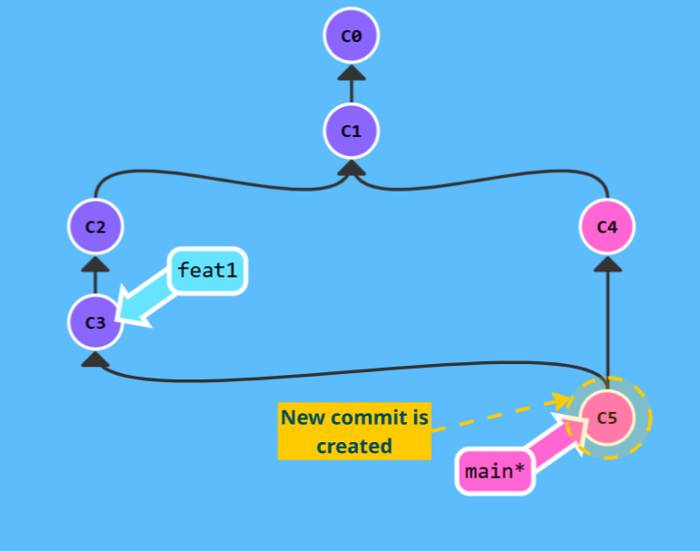
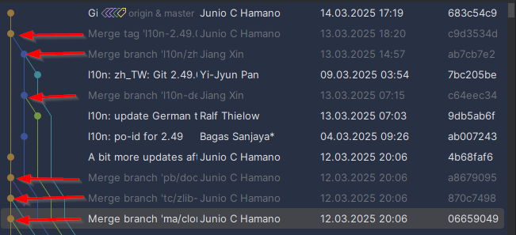
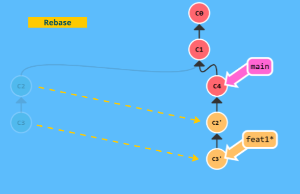
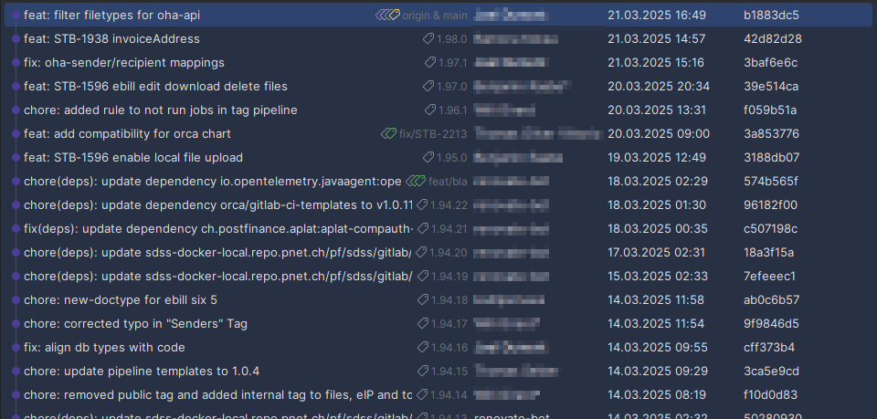
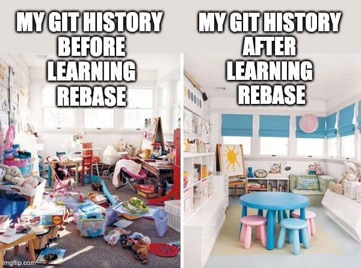

== Branching
:stylesheet: docs.css
:stylesdir: resources

=== Merge vs Rebase

==== Merge

* Merge creates a new commit (merge-commit)
+
This strategy is used by the git-project by itself:

==== Rebase

* Rebase adds commits at the end of the target branch without a new commit and assures a linear history.

___
📌 Provoke a merge conflict +
📌 Try the second tutorial *Branching in Git*: https://learngitbranching.js.org[Git Tutorials] +

___

[cols="a,>a",frame=none,grid=none]
|===
|xref:06_Git_areas.adoc[<- Back to Areas]
|xref:08_GIT_User_Interfaces.adoc[Continue to Git User Interfaces ->]
|===
