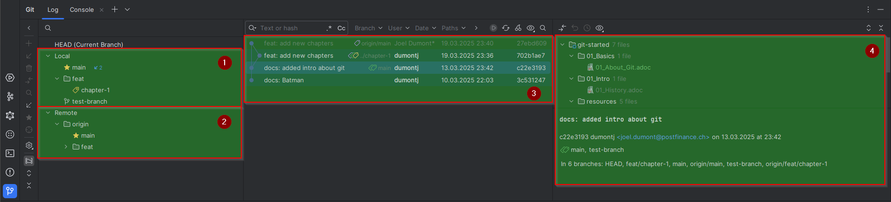
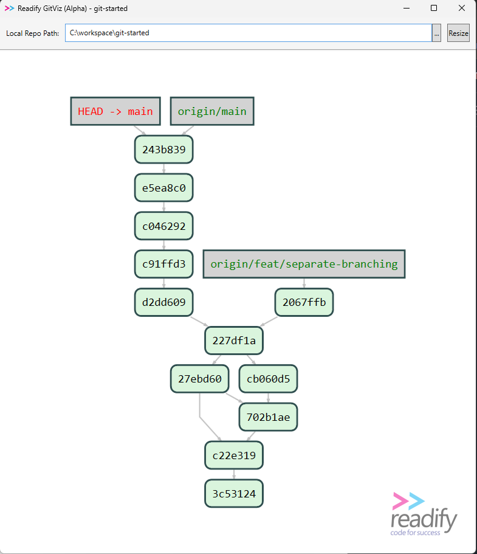

= Git User Interfaces

== ⚠️ A Note for Beginners: Use the Command Line First!

While **Git GUIs** can make things easier, it is highly recommended that beginners start with the **command line**.

✅ **Why?**
- You gain a **deeper understanding** of how Git works.
- You can **troubleshoot errors** more effectively.
- The command line works **consistently across all platforms**.
- Most advanced Git operations require the **terminal** anyway!

Once you're comfortable with **basic Git commands** like `git add`, `git commit`, `git push`, and `git pull`, then you can explore GUI tools like **GitKraken, Jetbrains Intellij, or GitHub Desktop**.

💡 **Start with the command line, master the fundamentals, and then decide if you want a GUI!** 🚀

== Intellij

. Local Branches
. Remote Branches
. Commit History
. Commit Infos (Message & changed files)

== GitKraken
image::resources/git-kraken.png[]

== Readify GitViz

