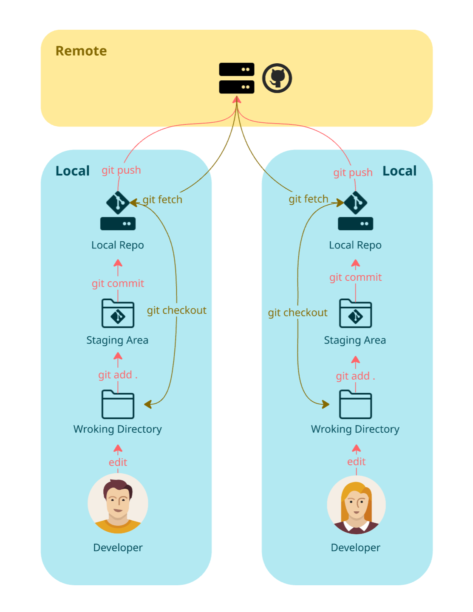

= Git Areas Explained

In **Git**, there are three main **areas** where changes can exist in a repository:

== 🔹 1. Working Directory (Untracked & Modified Files)

📌 **What is it?**
- The **working directory** (or working tree) is where you make changes to files.
- Any modified or newly created files exist **only in your local copy** of the repository.

📌 **How to check?**
[source,sh]
----
git status
----
- Files listed as **"modified"** or **"untracked"** are in the **working directory**.

📌 **Example:**
[source,sh]
----
echo "Hello World" > file.txt  # Create a new file
git status  # Shows "Untracked files: file.txt"
----

---

== 🔹 2. Staging Area (Index)

📌 **What is it?**
- The **staging area** (also called the **index**) is where Git tracks changes you intend to commit.
- Before committing, files must be **added to the staging area** using `git add`.

📌 **How to move files to staging?**
[source,sh]
----
git add file.txt  # Moves file.txt to staging
----

📌 **Check staged files:**
[source,sh]
----
git status
----
- Files in the **staging area** appear as **"Changes to be committed"**.

📌 **Example:**
[source,sh]
----
git add file.txt
git status
# Shows "Changes to be committed: file.txt"
----

---

== 🔹 3. Git Repository (Committed History)

📌 **What is it?**
- The **Git repository** (also called **.git directory**) stores committed changes **permanently**.
- Commits are saved as snapshots and linked to previous commits.

📌 **How to commit staged files?**
[source,sh]
----
git commit -m "Added file.txt"
----
- Now the change is saved in the **repository history**.

📌 **Check commit history:**
[source,sh]
----
git log --oneline
----

📌 **Example:**
[source,sh]
----
git commit -m "Added file.txt"
git log --oneline
# Shows latest commit with ID and message
----

---

== ✅ Summary of Git Areas

[cols="1,2,2", options="header"]
|===
| Git Area | Description | Command to Move to Next Stage
| **Working Directory** | Where you make changes | `git add file.txt`
| **Staging Area (Index)** | Prepares files for commit | `git commit -m "message"`
| **Git Repository** | Stores committed changes | `git push origin branch-name`
|===

---

== 🔥 Example Workflow

[source,sh]
----
echo "Hello World" > file.txt  # Create file
git status  # Shows untracked file (Working Directory)

git add file.txt
git status  # File moves to Staging Area

git commit -m "Added file.txt"
git log --oneline  # File is in Repository
----

