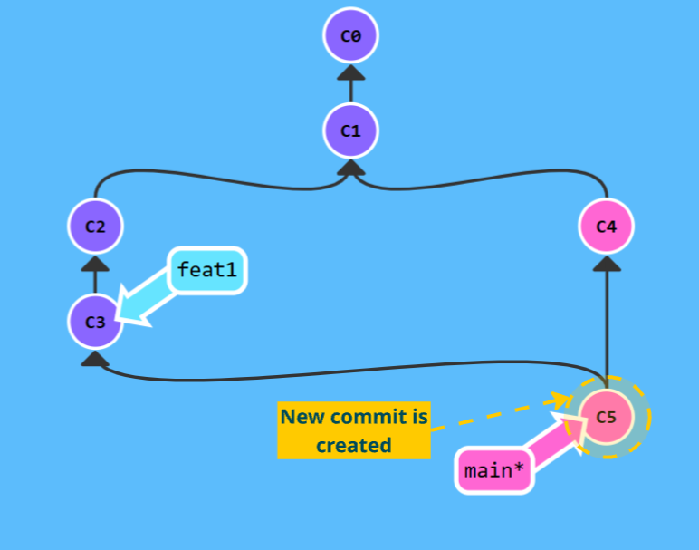
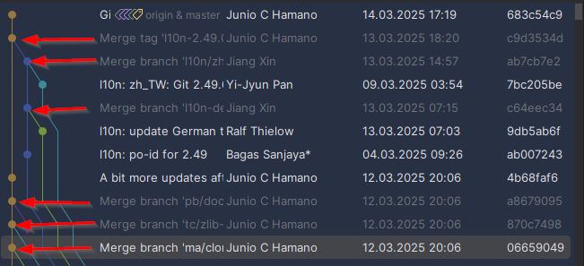
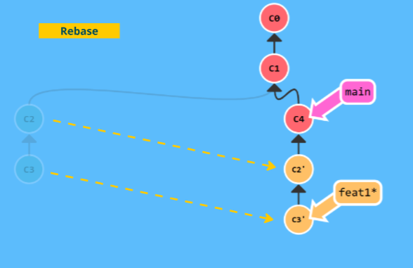
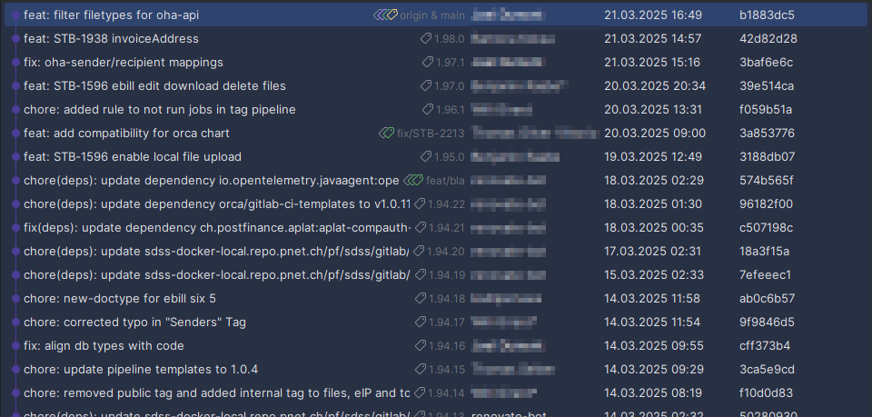

== Branching

=== Merge vs Rebase

==== Merge

* Merge creates a new commit (merge-commit)
+
This strategy is used by the git-project by itself:

==== Rebase

* Rebase adds commits at the end of the target branch without a new commit and assures a linear history.

___
📌 Provoke a merge-conflict
📌 Try the 2. tutorial *Branching in Git*: https://learngitbranching.js.org[Git Tutorials] +

___

[cols="a,a",frame=none,grid=none]
|===
|xref:07_Git_areas.adoc[<= Areas]
|xref:09_GIT_User_Interfaces.adoc[User Interfaces =>]
|===
