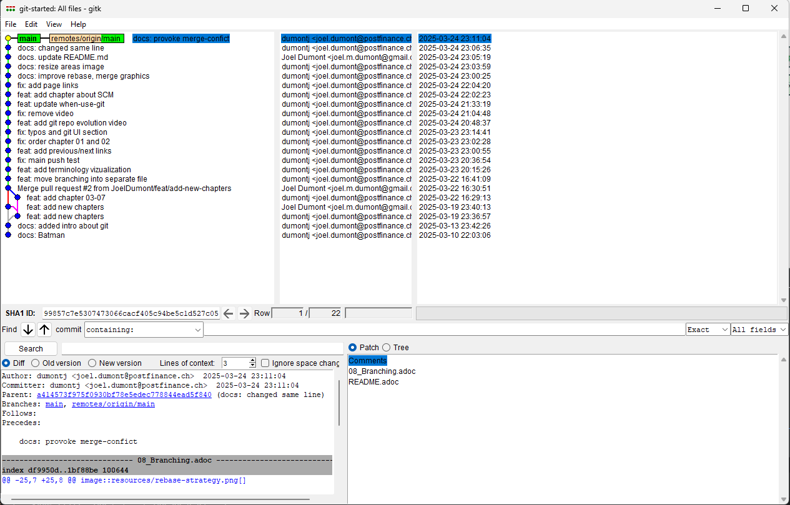
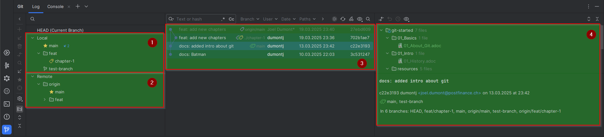
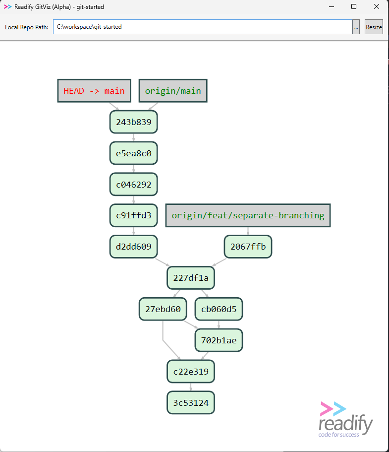

= User Interfaces

== ⚠️ A Note for Beginners: Use the Command Line First!

While **Git GUIs** can make things easier, it is highly recommended that beginners start with the **command line**.

**Why?**
- You gain a **deeper understanding** of how Git works.
- You can **troubleshoot errors** more effectively.
- The command line works **consistently across all platforms**.
- Most advanced Git operations require the **terminal** anyway!

Once you're comfortable with **basic Git commands** like `git add`, `git commit`, `git push`, and `git pull`, then you can explore GUI tools like **GitKraken, JetBrains IntelliJ, or GitHub Desktop**.

💡 **Start with the command line, master the fundamentals, and then decide if you want a GUI!** 🚀

== Git Built-in

[sh]
----
gitk
----

== Intellij

. Local Branches
. Remote Branches
. Commit History
. Commit Infos (Message & changed files)

== https://github.com/Readify/GitViz[Readify GitViz]

== More UIs
* https://www.gitkraken.com/[GitKraken]
* https://desktop.github.com/download/[GitHub Desktop] +
* https://www.sourcetreeapp.com/[Sourcetree]

[cols="a,>a",frame=none,grid=none]
|===
|xref:07_Github.adoc[<- Back to Github]
|xref:09_Helpful_resources.adoc[Continue to Helpful Resources ->]
|===
