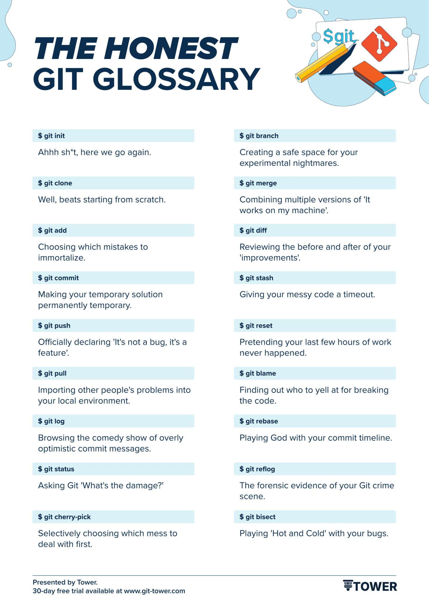

= Helpful resources

=== Shortcut Cheat Sheet
link:resources/git-cheat-sheet-education.pdf[Git Cheat-Sheet]

=== The Git Bible
Link to: link:./resources/book-pro-git.pdf[Git Pro Book]

=== Git Flow vs GitHub Flow
source: https://quangnguyennd.medium.com/git-flow-vs-github-flow-620c922b2cbd[Medium article]

=== The Honest Git Glossary

=== Original Linus Torvalds presentation
https://www.youtube.com/watch?v=4XpnKHJAok8[Linus on Git]

=== Build your own X
https://github.com/codecrafters-io/build-your-own-x?tab=readme-ov-file#build-your-own-git[Build your own Git]

[cols="a,a",frame=none,grid=none]
|===
|xref:09_GIT_User_Interfaces.adoc[<= Git User Interfaces]
|
|===

